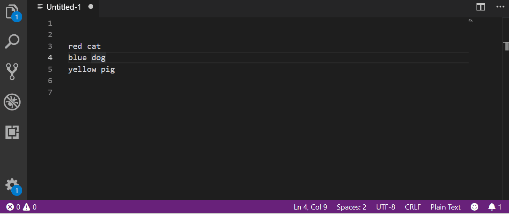

# Bcryptor hash on editor

With this extension is easy to hash one or multiple lines using bcrypt algorithm.

## Features

### Hash by line

Each line of plain text selected will be converted to a hash with selected round cost:

1. Select one or more lines.
2. Click "Bcrypt Lines" on Status bar.
3. Select Round Cost from list.
4. View the result replacing original text with the hash.

Remember the higher round cost the longer it takes to get hashed.

### Match plain text with hash

You can verify if plain text corresponds to some hash:

1. In one line set plain text.
2. Next line set hash.
3. Select the two lines.
4. Click "Match Lines" on Status bar.
5. Get a message telling if match or not.

If not enough lines are selected will get an error message.

## Release Notes

This first version is oriented to solve the needs of hashing and verifing text in and simple and fast way without going to Internet or external tool.

Minimum Round cost is 6 becouse lower is very insecure. Really lower than 12 too but could be so used yet.
And maximum is 18 becouse it is too cpu expensive, and the author preffers to research about the preffered limits for users and optimize extension ui/ux.

### 1.0.0

* Hash with min 6 and max 18 rounds.
* Match hashed text.

## Next Release

* Update Round cost range.
* Match more than one hash per selection.

## Contributing

All Pull Requests are welcome.
